# Basic CI/CD

## Part 1. Настройка gitlab-runner

* Поднял виртуальную машину *Ubuntu Server 22.04 LTS*

    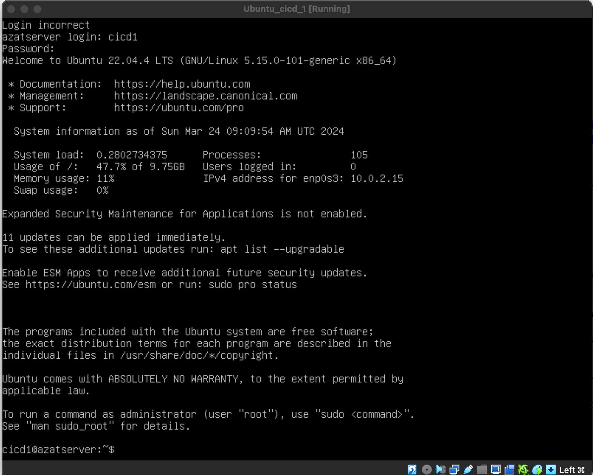

* Скачал и установил на виртуальную машину *gitlab-runner*

    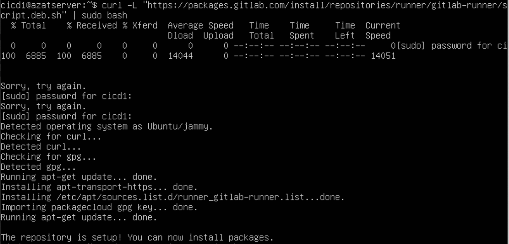

    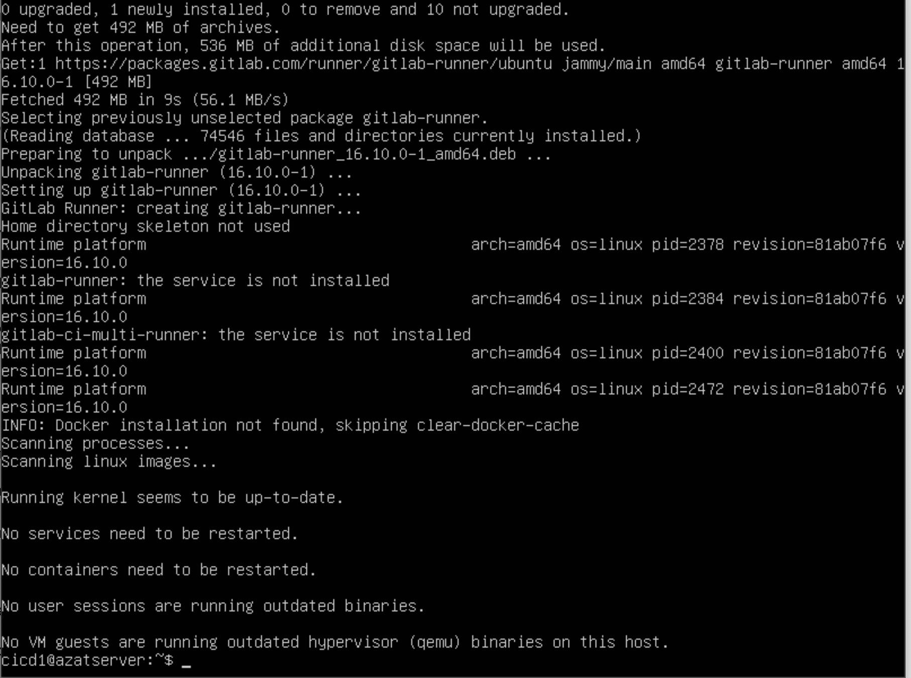

* Запустил *gitlab-runner* и зарегистрировал его для использования в текущем проекте (D06_CICD)

    * Для регистрации понадобятся URL и токен

    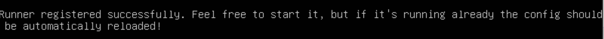

## Part 2. Сборка

Напиши этап для CI по сборке приложений из проекта C2_SimpleBashUtils.

В файле gitlab-ci.yml добавь этап запуска сборки через мейк файл из проекта C2.

Файлы, полученные после сборки (артефакты), сохрани в произвольную директорию со сроком хранения 30 дней.

1) Установка gitlab-runner подробно: https://docs.gitlab.com/runner/install/linux-manually.html

2) Регистрация gitlab-runner: https://docs.gitlab.com/runner/register/index.html

    1. Во время регистрации ВАЖНО предоставить URL, registration token, tag (этот tag потом надо будет указать в файле .gitlab-ci.yml)

    2. Написать файл .gitlab-ci.yml

        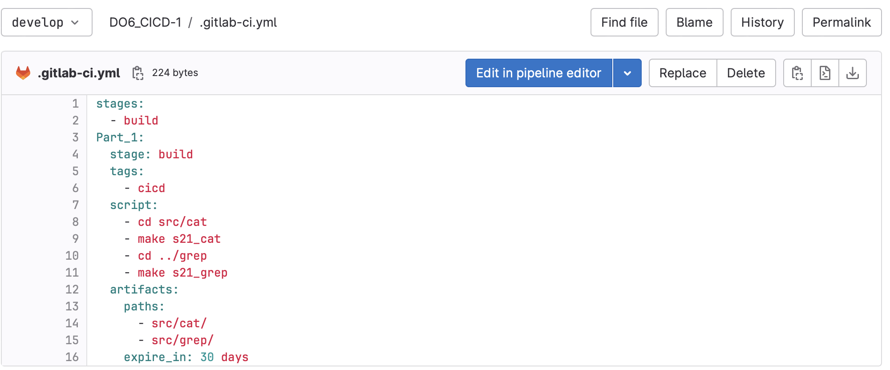

3) Запушить корневую папку вместе с файлом .gitlab-ci.yml (находится выше папки src) и проектом SimpleBashUtils (папки cat и grep)

4) Пронаблюдать автоматическую работу Pipeline'а

    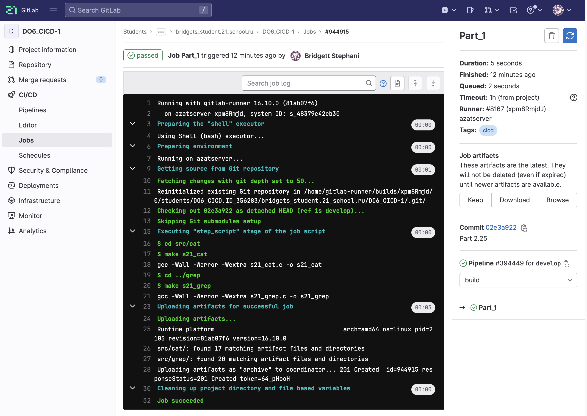

**Важно установить необходимые пакеты по тиму make, gcc на виртуальную машину (т.е Worker на котором стоит gitlab-runner, clang-format)**

## Part 3. Тест кодстайла
== Задание ==

Напиши этап для CI, который запускает скрипт кодстайла (clang-format).
Если кодстайл не прошел, то «зафейли» пайплайн.
В пайплайне отобрази вывод утилиты clang-format.

1) дописал в файл .gitlab-ci.yml следующие строки:

    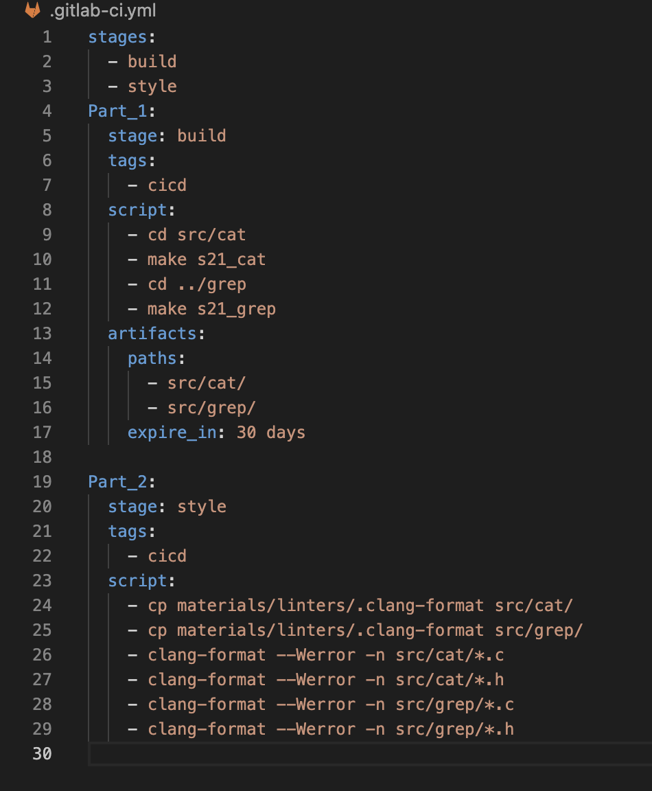

2) Проверил, что pipeline фейлится при фейле clang-format, и pipeline выдает success при успешном проогоне clang-format

    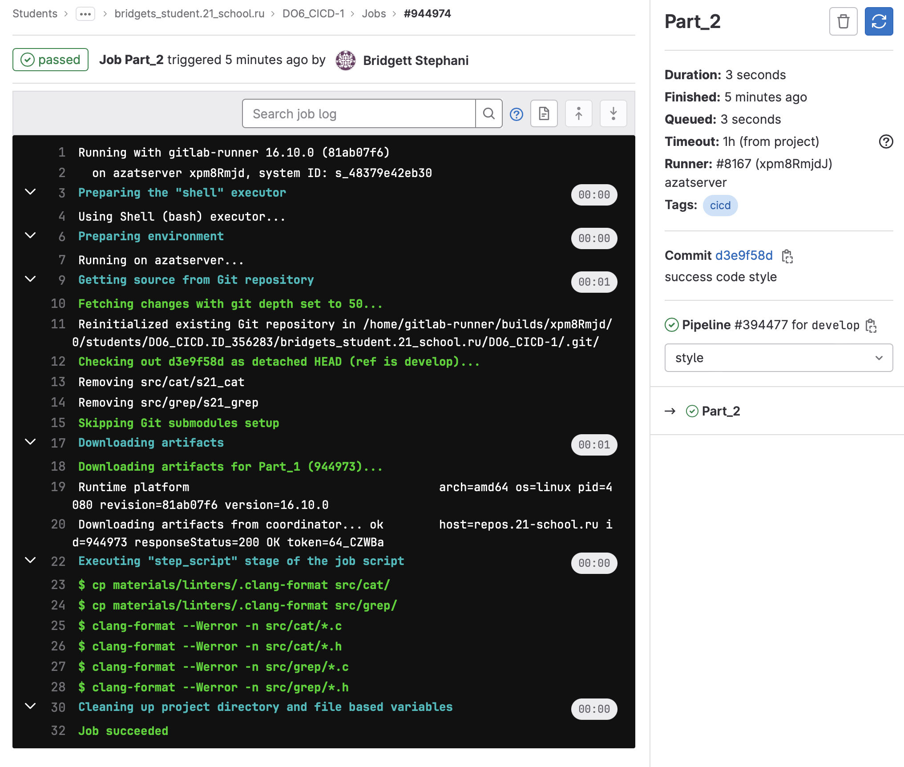

    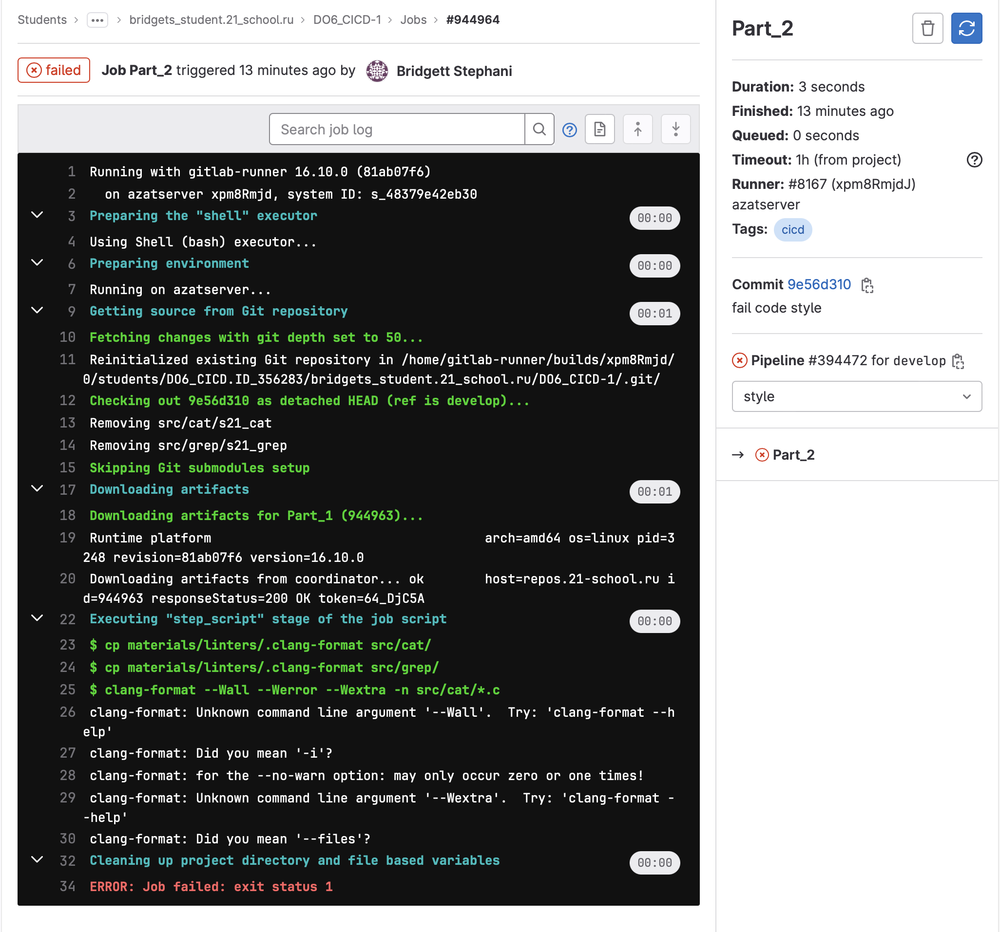


**Для того, чтобы pipeline зафейлился при нарушении код стайла (ошибка по clang-format), нужно прописать в файле *.yml clang-format --Werror -n *.c**

## Part 4. Интеграционные тесты
== Задание ==

Напиши этап для CI, который запускает твои интеграционные тесты из того же проекта.
Запусти этот этап автоматически только при условии, если сборка и тест кодстайла прошли успешно.
Если тесты не прошли, то «зафейли» пайплайн.
В пайплайне отобрази вывод, что интеграционные тесты успешно прошли / провалились.

1) Написал в pipeline интсрукцию для проверки тестов

    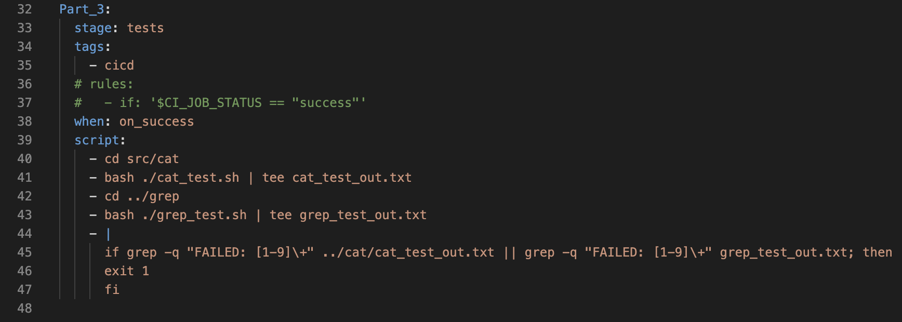

2) строка ```when: on_success``` говорит нам о том, что последующие инструкции будут выполнены при условии успешного выполнения предыдущих частей (Part'ов)

3) ```if grep -q "FAILED: [1-9]\+" ../cat/cat_test_out.txt || grep -q "FAILED: [1-9]\+" grep_test_out.txt; then```
    ```exit 1```
    ```fi``` 
    означает что pipeline зафейлит (exit 1), в случае, когда в результате тестов будут фейлы больше нулевого значения

4) ```- |``` означает многострочную запись

* Случай, когда pipeline зафейлен из-за отсутсвия код стайла (а Part_3 со сборкой тестов пропущена)

    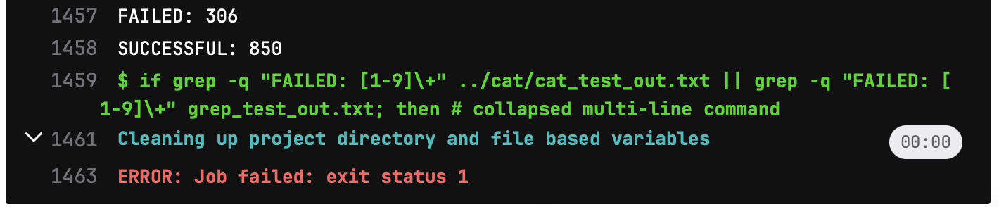

* Случай, когда pipeline зафейлен из-за наличия фейлов в результате прогонки тестов

    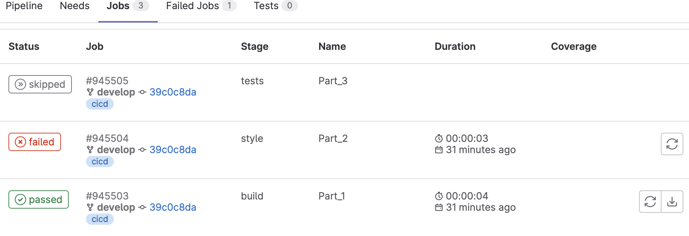

**Шпаргалка https://www.dmosk.ru/miniinstruktions.php?mini=gitlab-pipeline#tasks-artifacts**

## Part 5. Этап деплоя
* Запуск этого этапа при условии, что все предыдущие этапы прошли успешно.
* Написал bash-скрипт, который при помощи ssh и scp копирует файлы, полученные после сборки (артефакты), в директорию /usr/local/bin второй виртуальной машины (Linux_Network CHEEECK).
* В файле gitlab-ci.yml добавил этап запуска написанного скрипта.
* В случае ошибки пайплайн должен быть зафейлен.

1) Поднял вторую виртуальную машину

    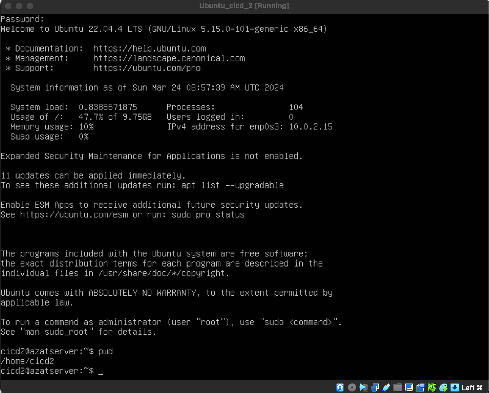

2) Далее Написал этап для CD (последовательно):
    1. Прописал статическую маршрутизацию на обеих машинах используя адаптор Internak Network(в настройках VirtualBox, intnet). Машины должны пинговаться!

        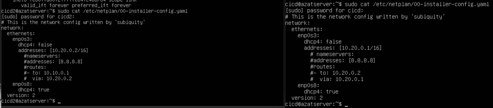

    2. Выполнил следующие команды на первой машине:
        * ```sudo su gitlab-runner```
        * ```ssh-keygen -t rsa -b 2048```
            
            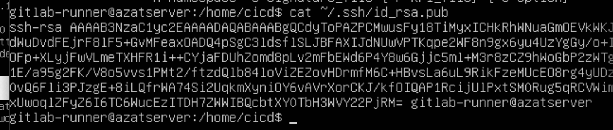

        * ```ssh-copy-id (название вользователя на 2й машине)@ip-адрес(2й машины)```

            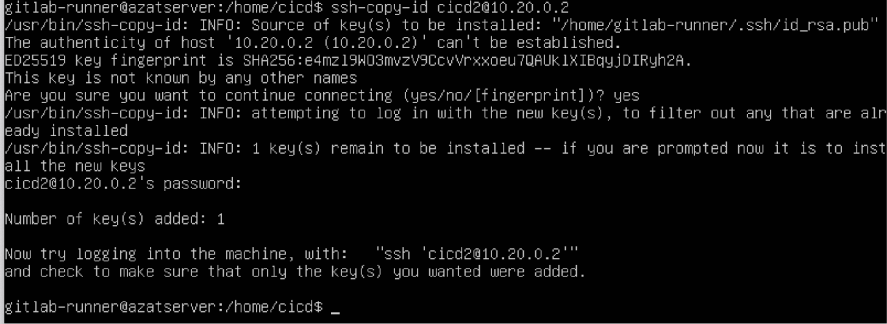

    3. На второй машине:
        * ```sudo chmod 777 /usr/local/bin``` 
    4. На первой машине:
        * ```sudo gitlab-runner rn```

            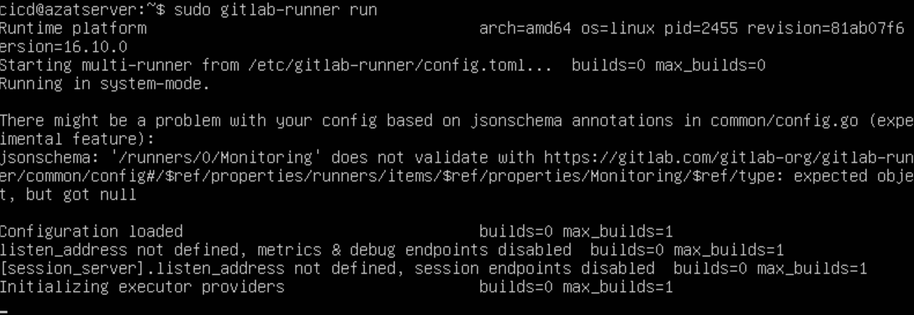

    5. Дописал в файл .gitlab-ci.yml:

        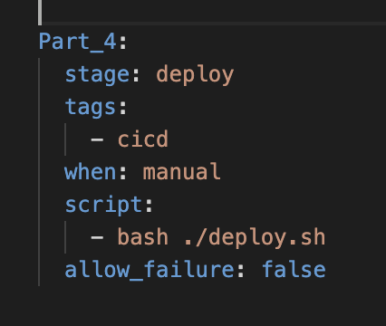

3) Запушил на gitlab:

    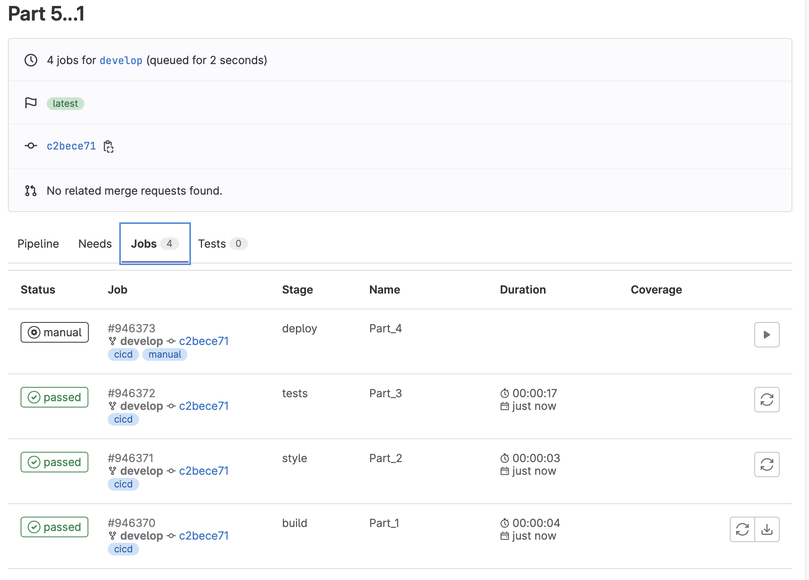

    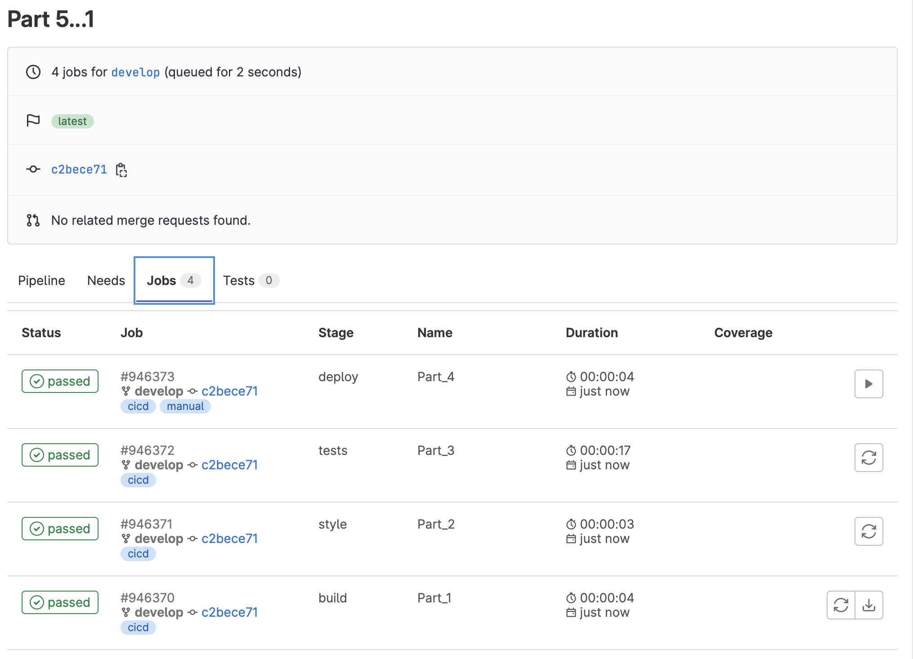

4) Сохранил дампы образов виртуальных машин.

**Переменные в gitlab-ci https://sysadmintalks.ru/gitlab-ci-variables/**


## Part 6. Дополнительно. Уведомления
- Здесь написано, что твое следующее задание выполняется специально для нобелевских лауреатов. Здесь не сказано, за что они получили премию, но точно не за умение работать с gitlab-runner.
== Задание ==

Настрой уведомления о успешном/неуспешном выполнении пайплайна через бота с именем «[твой nickname] DO6 CI/CD» в Telegram.

Текст уведомления должен содержать информацию об успешности прохождения как этапа CI, так и этапа CD.
В остальном текст уведомления может быть произвольным.